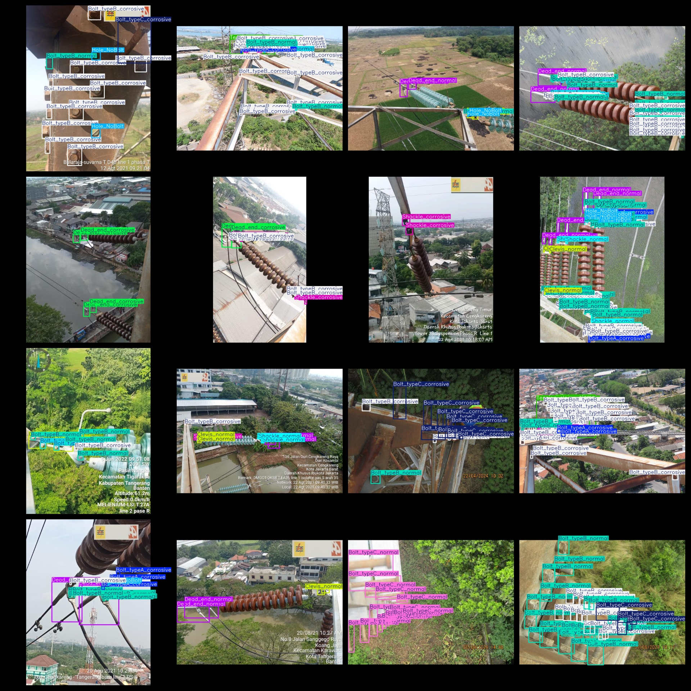
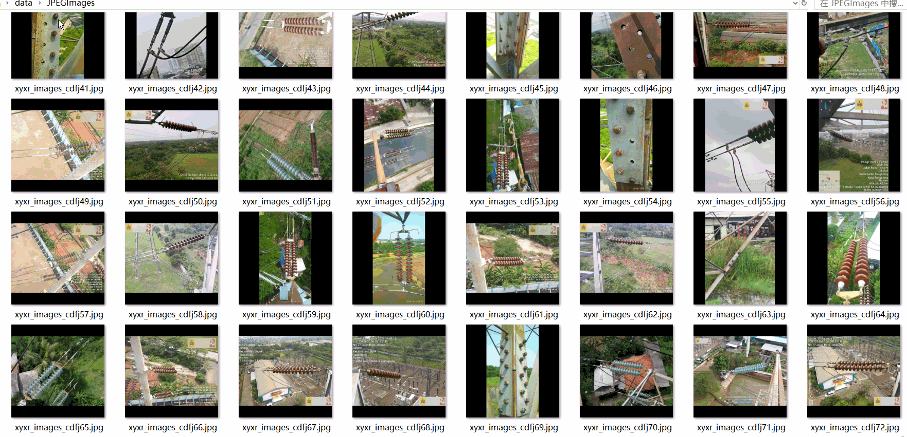

# Aerial Power Inspection Bolt Defect Detection Dataset 1576 imagesVOC+YOLO

Aerial power patrol bolt defect detection data set 1576 VOC + YOLO

Dataset format: Pascal VOC format + YOLO format (the txt file does not contain the split path, it only contains jpg images and corresponding VOC format xml files and yolo format txt files)

Number of image files: 1576

Number of xml files: 1576

Number of txt files: 1576

Number of categories: 14

The Github repository is: datasets_sl

["Bolt_typeA_corrosive", "Bolt_typeA_normal", "Bolt_typeB_corrosive", "Bolt_typeB_normal", "Bolt_typeC_corrosive", "Bolt_typeC_normal", "Clevis_corrosive", "Clevis_normal", "Dead_end_corrosive", "Dead_end_normal", "Hole_NoBolt", "Shackle_corrosive", "Shackle_normal", "Tension_clamp"]

Tag Chinese Translation: A type bolt_corrosion, A type bolt_normal, B type bolt_corrosion, B type bolt_normal, C type bolt_corrosion, C type bolt_normal, U-shaped hook_corrosion, U-shaped hook_normal, Tensile clamp_corrosion, Tensile clamp_normal, Hole_without bolt, U-shaped ring_corrosion, U-shaped ring_normal, Tensile clamp

Number of boxes labeled in each category:

Bolt_typeA_corrosive frame count = 993

Bolt_typeA_normal frame count = 485

Bolt_typeB_corrosive frame count = 10180

Bolt_typeB_normal frame count = 4320

Bolt_typeC_corrosive frame count = 1162

Bolt_typeC_normal frame count = 506

Clevis corrosive frame number = 805

The number of frames in the Clevis_normal box is 559.

Dead_end_corrosive frame count = 982

Dead_end_normal frame count = 923

Hole_NoBolt Frames = 3291

Shackle_corrosive frame count = 902

Shackle_normal box count = 650

Tension_clamp frame number = 267

Total Frames: 26025

Number of images per category:

Bolt_typeA_corrosive occupies 470 images.

BolT_typeA_normal occupies the number of images = 268

Bolt_typeB_corrosive_image_count = 1147

Bolt_typeB_normal occupies the number of images = 764

Bolt_typeC_corrosive occupies 149 images.

Bolt_typeC_normal occupies 65 images.

Clevis_corrosive_occupy_pictures_count = 317

Clevis_normal_holds_image_count = 291

Dead_end_corrosive_image_count = 509

Dead_end_normal occupies 468 images.

Hole_NoBolt_Occupy_Images_Count = 628

Shackle_corrosive occupies a total of 388 images.

Shackle_normal occupies 327 images.

Tension_clamp occupies 178 images.

Image resolution: 640x640

Use the labeling tool: labelImg

Dataset Augmentation: No

Rules for annotation: Draw a rectangle around the category.

Important note: The dataset does not have been divided into training, validation, and testing sets.

Special Disclaimer: This dataset does not guarantee the accuracy of the trained models or weight files.

Annotation and image details are as follows:

## Images

---

Here is a pay link on Stripe (https://buy.stripe.com/3cs8yP7sY87d0vu9AB). Please contact me lonlonago@foxmail.com after funding $89, and I will send you a complete data files, thank you!

